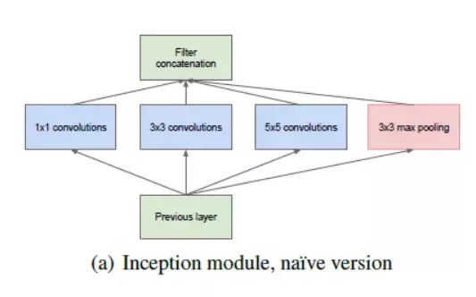

# 什么是 Google Inception?

The module basically acts as multiple convolution filter inputs, that are processed on the same input. It also does pooling at the same time. All the results are then concatenated. This allows the model to take advantage of multi-level feature extraction from each input. For instance, it extracts general (5x5) and local (1x1) features at the same time.

## 参考:
[1] [Going Deep with Convolutions](https://arxiv.org/abs/1409.4842)
[2] [Quora: How does the Inception module work in GoogLeNet deep architecture?](https://www.quora.com/How-does-the-Inception-module-work-in-GoogLeNet-deep-architecture)
[3] [Inception modules: explained and implemented](https://hacktilldawn.com/2016/09/25/inception-modules-explained-and-implemented/): 根据 “Going Deep with Convolutions.”  一文实现了一个Inception网络的toy example。
