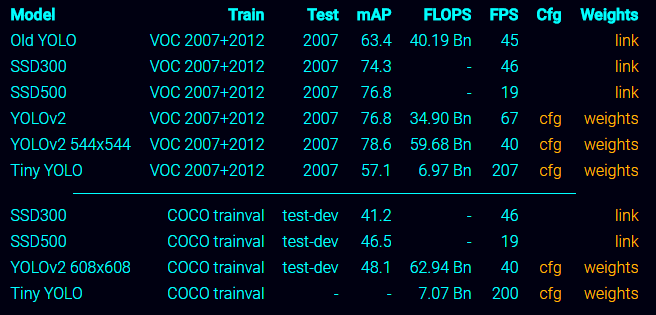

- [A Brief History of CNNs in Image Segmentation: From R-CNN to Mask R-CNN](https://blog.athelas.com/a-brief-history-of-cnns-in-image-segmentation-from-r-cnn-to-mask-r-cnn-34ea83205de4)
- [Is Google Tensorflow Object Detection API the easiest way to implement image recognition?](https://towardsdatascience.com/is-google-tensorflow-object-detection-api-the-easiest-way-to-implement-image-recognition-a8bd1f500ea0)
- [Building a Toy Detector with Tensorflow Object Detection API](https://towardsdatascience.com/building-a-toy-detector-with-tensorflow-object-detection-api-63c0fdf2ac95)
- [目标检测方法系列——R-CNN, SPP, Fast R-CNN, Faster R-CNN, YOLO, SSD](http://www.cnblogs.com/lillylin/p/6207119.html)
- [A Year in Computer Vision](http://www.themtank.org/a-year-in-computer-vision)
- [Object Detection](https://handong1587.github.io/deep_learning/2015/10/09/object-detection.html)

Papers
- R-CNN: https://arxiv.org/abs/1311.2524
- Fast R-CNN: https://arxiv.org/abs/1504.08083
- Faster R-CNN: https://arxiv.org/abs/1506.01497
- Mask R-CNN: https://arxiv.org/abs/1703.06870

## 概况

## 相关数据集
#### 1. COCO (Common Objects in Context)

http://cocodataset.org/#home

This is a dataset of 300k images of 90 most commonly found objects. Examples of objects includes:

## YOLO
主页: https://pjreddie.com/darknet/yolo/

- It looks at the whole image at test time so its predictions are informed by global context in the image
- Fast: more than 1000x faster than R-CNN and 100x faster than Fast R-CNN

V2的改进:
- 使用FCN
- 整个图像作为输入。
- bbox的预测: Like Faster R-CNN we adjust priors on bounding boxes instead of predicting the width and height outright. However, we still predict the x and y coordinates directly

什么是`hard negative`?

论文学习:
- [论文阅读笔记：You Only Look Once: Unified, Real-Time Object Detection](http://blog.csdn.net/tangwei2014/article/details/50915317)
