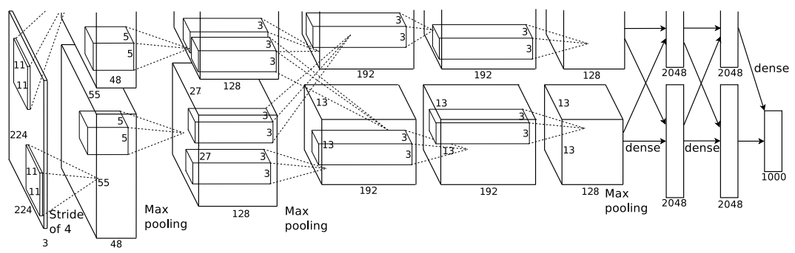
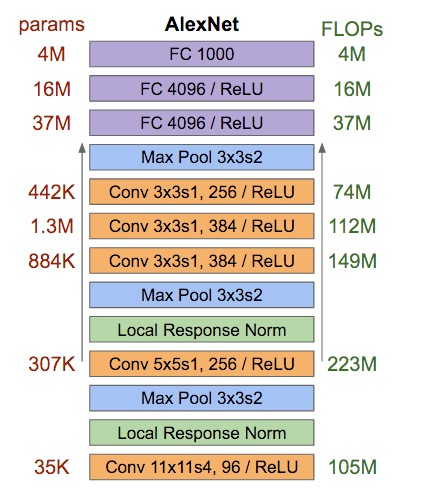
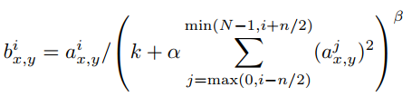
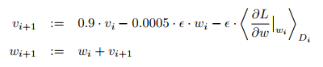

## 论文学习笔记: AlexNet

原文: [ImageNet Classification with Deep Convolutional Neural Networks](https://papers.nips.cc/paper/4824-imagenet-classification-with-deep-convolutional-neural-networks)

AlexNet是计算机视觉识别比赛 [ILSVRC](http://www.image-net.org/challenges/LSVRC/2012/) 2012年的冠军模型，作者是 Geoffrey E. Hinton 的学生 Alex Krizhevsky。AlexNet是一个多层卷积神经网络，包含5个卷积层和3个全连接层，一共有6000万个参数，650000个神经元。在训练过程中使用了多种trick来提高训练时间，如使用RELU(Rectified
Linear Units)作为激活函数、双GPU训练、使用LRN(Local Response Normalization)规范化RELU输出, 使用有交叠的Max-Pooling来做降采样；同时，通过数据增强、Dropout来防止过拟合。最终，模型的top1和top5错误率分别达到了36.7%和15.3%， 远远超过其他基于传统图像特征(如 [Fisher Vectors](http://www.vlfeat.org/api/fisher-fundamentals.html)) 的机器学习方法。相关的代码已经开源在Google Code: [cuda-convnet](https://code.google.com/archive/p/cuda-convnet/)， 同时，论文也发表于NIPS 2012上。截止目前(2017年12月4日), 该论文在Google Scholar上的引用次数已经达到17461次。

AlexNet是深度学习在计算视觉领域上的里程碑式突破。从此，深度卷积网络进入前所未有的发展时代，也带了深度学习的第三次狂热复兴。

尽管，在今天看来，AlexNet已经太过陈旧和过时，但是其基本设计架构和优化技巧仍然具有深远的影响。同时，学习AlexNet也是我们了解深度学习历史不可绕过的一部分。

论文本身主是对图像分类任务的详细说明，所以，在文章组织上也是从数据、模型、优化与评测这几个维度来阐述的。

## 关于数据集
ILSVRC竞赛是Pascal Visual Object Challenge的一部分，使用的数据集是ImageNet图像数据集的一个子集。ImageNet拥有超过1500万的高分辨率图像，分属于2.2万个分类。这些图片通过Amazon的Mechanical Turl众包工具从网络上收集。在LSVRC比赛中使用的子集则有120万的训练图像，5万的验证集和15万的测试数据集。

由于卷积网络的输入是固定大小的，所以需要对各种尺寸的图像做下适配。在本文中，首先对图像缩放，使得较短的一边为256， 然后从中间剪裁，使得剪裁后的图片大小为256 x 256.

## 网络架构

输入图片大小为224x224x3, 上下两部分对应于两个GPU。下图则更直观地显示了各层的参数:

#### 训练加速
- ReLU Nonlinearity: 与tanh相比，使用ReLU可以将训练速度提高数倍。
- 多GPU并行: 每个GPU分配一半的filter, 跨GPU通信仅在特定的层发生。与仅使用一半卷积的单GPU网络相比，top1和top5的错误率分别降低了1.7% 和 1.2%。
- 局部响应归一化(后来有论文证明这一步作用不大):

- Overlapping Pooling: 使用overlapping pooling也使得模型更不容易过拟合。

#### 解决过拟合问题
- 数据增强。有两种方式，一种是对图片的平移和水平翻转，预测时取5个patch然后取平均。另一种方式是采用PGA降维后叠加于原像素上。Alex如果没有这一层，过拟合会非常严重。
- Dropout: 被dropped out的神经元既不参与前向传播也不参与反向传播。使用Dropout的目的是为了减小神经元之间复杂的co-adaption效应，使得神经元能够学习到不依赖于其他特定神经元的更加健壮的特征。Dropout应用于前两个全连接层。Alex如果没有这一层，过拟合会非常严重。

## 关于训练的更多细节。
AlexNet使用随机梯度下降来训练，batch size 为128， momentum系数为0.9, weight decay系数为0.0005。
权重w的更新规则如下:

Alex提到，使用weight decay不仅可以解决过拟合问题，也可以提高训练时的精度。

所有的神经元参数使用均值为0、方差为0.01的高斯分布来初始化。但在偏置的初始化上，2、4、5和全连接层是1， 剩下的层是0， 这样可以使得RELU在一开始有着正的激活值，提升了初始时的训练速度。甚至为什么只选择了2、4、5层，而没选择1、3层，作者并未解释。

关于学习速率的选择。
学习速率在所有层是一致的，但是在训练过程中不断调整。在每轮训练结束时，如果验证集上的准确率没有提升，则将学习速率降为原来的1/10。初始为0.01， 在整个训练过程中一共减了3次。

总训练时间:
一共90个epochs, 在两块NVIDIA GTX 580 3GB GPUs上训练时间为五至六天。

## 效果
在ILSVRC'2010比赛中，当时的最好结果的TOP1和TOP5错误率分别为47.1%和28.2%，是由基于不同特征集的6个稀疏编码模型得到的。在此之后的最好成绩也只有45.7%和25.7%, 使用的是两个基于Fisher Vectors的两个模型的整合。

另外，Alex也演示了，使用倒数第二层作为为图片特征后，通过余弦相似度可以用来发现相似图片。
