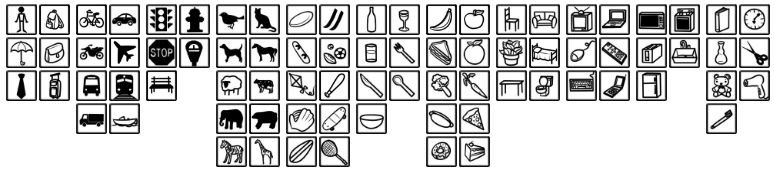

- [Fueling the Gold Rush: The Greatest Public Datasets for AI](https://medium.com/startup-grind/fueling-the-ai-gold-rush-7ae438505bc2): 文中有些小错误，比如MNIST的图片大小是28x28, 而不是25x25。

## 最常用
- [MNIST: THE MNIST DATABASE of handwritten digits](http://yann.lecun.com/exdb/mnist/)
- [The CIFAR-10 dataset](https://www.cs.toronto.edu/~kriz/cifar.html)
- [ImageNet](http://image-net.org/)
- [The PASCAL Visual Object Classes Homepage](http://host.robots.ox.ac.uk/pascal/VOC/)
- [MS COCO](http://cocodataset.org/#home): 80 object categories, 330K images.


## 其他

- [Clothing Co-Parsing (CCP) Dataset](https://github.com/bearpaw/clothing-co-parsing.git): 服饰数据集，包括59个标签，2098张高分辨率街拍时尚照片。
- [Fashion-MNIST](https://github.com/zalandoresearch/fashion-mnist.git)
- [Manga109 dataset and creation of metadata](https://dl.acm.org/citation.cfm?doid=3011549.3011551)
- [The Oxford-IIIT Pet Dataset](http://www.robots.ox.ac.uk/~vgg/data/pets/): 牛津大学宠物数据集。37个分类，每个分类约200张图片。
- [LLD - Large Logo Dataset](https://data.vision.ee.ethz.ch/cvl/lld/)
- [YouTube-music-video-5M [BETA]](https://github.com/keunwoochoi/YouTube-music-video-5M.git)
- [animals with attributes 2](http://cvml.ist.ac.at/AwA2/)
- [A Generative Model of People in Clothing](http://files.is.tue.mpg.de/classner/gp/)
- [COCO-Stuff 10K dataset v1.1](https://github.com/nightrome/cocostuff.git): COCO的扩展数据集。
- [xeno-canto: Sharing bird sounds from around the world](http://www.xeno-canto.org/)
- [DANBOORU2017: A LARGE-SCALE CROWDSOURCED AND TAGGED ANIME ILLUSTRATION DATASET](https://www.gwern.net/Danbooru2017#hosting)


## 附录
#### MS COCO 分类

```
person
backpack
umbrella
handbag
tie
suitcase
bicycle
car
motorcycle
airplane
bus
train
truck
boat
traffic light
fire hydrant
stop sign
parking meter
bench
bird
cat
dog
horse
sheep
cow
elephant
bear
zebra
giraffe
frisbee
skis
snowboard
sports ball
kite
baseball bat
baseball glove
skateboard
surfboard
tennis racket
bottle
wine glass
cup
fork
knife
spoon
bowl
banana
apple
sandwich
orange
broccoli
carrot
hot dog
pizza
donut
cake
chair
couch
potted plant
bed
dining table
toilet
tv
laptop
mouse
remote
keyboard
cell phone
microwave
oven
toaster
sink
refrigerator
book
clock
vase
scissors
teddy bear
hair drier
toothbrush
```

#### Pascal VOC

20 classes:
- `Person`: person
- `Animal`: bird, cat, cow, dog, horse, sheep
- `Vehicle`: aeroplane, bicycle, boat, bus, car, motorbike, train
- `Indoor`: bottle, chair, dining table, potted plant, sofa, tv/monitor
- `Train/validation/test`: 9,963 images containing 24,640 annotated objects.
